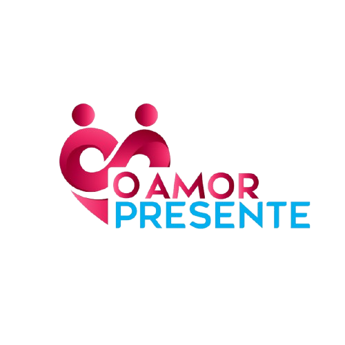

<!DOCTYPE html>
<html lang="pt-br">
<head>
<meta charset="utf-8">
<meta name="viewport" content="width=device-width, initial-scale=1">
<title>O Amor Presente — Vivência de Casais</title>
<meta name="description" content="Vivência de Casais — um encontro para reconectar, comunicar e fortalecer o compromisso consciente.">

</head>
<body>

<!-- HERO -->

  

    

      VIVÊNCIA DE CASAIS
      
      
<strong>“Reconectar: A Linguagem do Amor em Movimento”</strong>

    

  

<!-- O QUE É -->
<section>
  

    <h2>O QUE É?</h2>
    
Um encontro imersivo para casais cuidarem do vínculo: diálogo, respeito, afeto e recomeço.

  

</section>

<!-- RESULTADOS -->
<section>
  

    <h2>RESULTADOS</h2>
    <ul class="list-check">
      <li>Reconexão emocional;</li>
      <li>Comunicação respeitosa;</li>
      <li>Ressignificação de feridas;</li>
      <li>Compromisso consciente.</li>
    </ul>
  

</section>

<!-- INVESTIMENTO -->
<section id="precos">
  

    <h2>Investimento (por casal)</h2>
    

      

1º Lote

R$ 620,00

      

2º Lote

R$ 800,00

      

3º Lote

R$ 998,00

    

  

</section>

<!-- DEPOIMENTOS -->
<section id="depoimentos">
  

    <h2>Depoimentos</h2>
    

      

Grasiela

Olhar mais para nós como casal...

      

Mateus

Aprendi mais sobre as linguagens do amor...

      <!-- Continue alternando F/M como antes -->
    

  

</section>

<footer style="background:var(--rose);color:#fff;padding:18px;text-align:center">
  © O Amor Presente — Vivência de Casais. Todos os direitos reservados.
</footer>

<!-- Botão WhatsApp -->
<a class="whats-float" href="https://wa.me/5549998110445?text=Oi%20quero%20saber%20mais%20sobre%20a%20Viv%C3%AAncia" target="_blank" rel="noopener">
  <svg viewBox="0 0 24 24"><path d="M20.5 3.5A10 10 0 0 0 3.2 17.7L2 22l4.4-1.2A10 10 0 1 0 20.5 3.5Z"/></svg>
</a>

</body>
</html>
