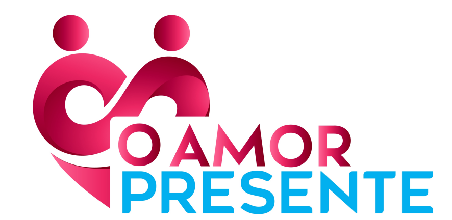

<html lang="pt-br">
<head>
  <meta charset="UTF-8" />
  <meta name="viewport" content="width=device-width, initial-scale=1" />
  <title>Vivência de Casais – O Amor Presente</title>
  
</head>
<body>

  <header>
    
    
Vivência de Casais

  </header>

  <main>
    <!-- Seção O que é e Resultados -->
    <section id="sobre">
      

        

          <h2>O que é a vivência?</h2>
          
Mais que um encontro: um dia imersivo para casais mergulharem em experiências que abrem espaço para diálogo, afeto, perdão e sonho compartilhado. Aqui, vocês vão se olhar de novo, se ouvir de verdade e reencontrar o amor como escolha diária.

        

        

          <h2>Resultados</h2>
          <ul class="list-check">
            <li>Reconexão emocional e leveza;</li>
            <li>Comunicação respeitosa e clara;</li>
            <li>Ressignificação de feridas e aprendizados;</li>
            <li>Compromisso consciente no dia a dia.</li>
          </ul>
        

      

    </section>

    <!-- Investimento -->
    <section id="precos">
      <h2>Investimento (por casal)</h2>
      

        

          <h3>1º Lote</h3>
          
R$ 620,00

          
Vagas limitadas

        

        

          <h3>2º Lote</h3>
          
R$ 800,00

          
Sujeito à disponibilidade

        

        

          <h3>3º Lote</h3>
          
R$ 998,00

          
Últimas vagas

        

      

    </section>

    <!-- Depoimentos -->
    <section id="depoimentos">
      <h2>Depoimentos</h2>
      

        

Grasiela Nardino

Hoje percebi que devemos olhar mais para nós como casal...

        

Mateus Battistela

Hoje valeu a pena porque aprendi um pouco mais sobre nosso relacionamento...

        

Alini De Paris

Hoje valeu a pena porque a comunicação clara e expressiva em um relacionamento é muito importante...

        

Marcelo Pissaia Novo

Hoje percebi que devemos olhar para a pessoa que está ao nosso lado com amor e respeito...

        

Joice

A vivência de hoje foi mais uma vez, uma experiência única que superou as expectativas...

        

Jean Camargo

Hoje percebi que devemos cultivar amor próprio primordialmente para depois oferecer na relação...

        

Ivete

Hoje percebi que valeu a pena o encontro de casal para entender um ao outro...

        

Valdemar

Valeu a pena porque senti a necessidade de buscar mais apoio quando o casal está com dores.

        

Roselei Teles

Hoje percebi que um relacionamento saudável é baseado em confiança, em si mesma e no outro...

        

Claudete

Valeu a pena pois percebi o quanto é importante a confiança e o compartilhamento de sonhos...

      

    </section>

    <!-- Inscrição -->
    <section id="inscricao">
      <h2>Garanta sua vaga</h2>
      
As vagas são limitadas. Clique no botão abaixo para iniciar sua inscrição.

      

        <a class="card pink" href="#" title="Link do formulário/checkout" style="text-decoration:none;font-weight:700;text-align:center">Quero Participar</a>
        <a class="card blue" href="https://wa.me/5549998110445?text=Quero%20saber%20mais%20sobre%20a%20Viv%C3%AAncia%20O%20Amor%20Presente" target="_blank" rel="noopener" style="text-decoration:none;font-weight:700;text-align:center">Falar no WhatsApp</a>
      

    </section>
  </main>

  

  <footer>
    © O Amor Presente — Vivência de Casais. Todos os direitos reservados.
  </footer>

</body>
</html>
