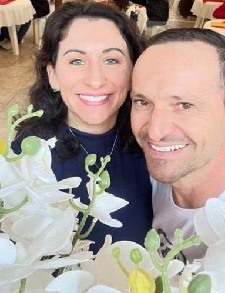

<html lang="pt-br">
<head>
  <meta charset="utf-8" />
  <meta name="viewport" content="width=device-width, initial-scale=1" />
  <title>Vivência de Casais – O Amor Presente</title>
  <meta name="description" content="Vivência de Casais O Amor Presente — um dia inteiro para reconectar, comunicar, ressignificar e fortalecer o compromisso consciente." />
  
</head>
<body>

  <!-- FAIXA ROSA -->
  
Vivência de Casais

  <!-- HERO -->
  

    

      

        
        
<strong>“Reconectar: A Linguagem do Amor em Movimento”.</strong>

        

        <!-- O que é + Resultados -->
        

          

            <h2 class="grad-left">O que é a vivência?</h2>
            
Mais que um encontro: um dia imersivo para casais mergulharem em experiências que abrem espaço para diálogo, afeto, perdão e sonho compartilhado. Aqui, vocês vão se olhar de novo, se ouvir de verdade e reencontrar o amor como escolha diária.

          

          

            <h2 class="grad-left">Resultados</h2>
            <ul class="list-check">
              <li><strong>Reconexão emocional</strong> e leveza;</li>
              <li><strong>Comunicação respeitosa</strong> e clara;</li>
              <li><strong>Ressignificação de feridas</strong> e aprendizados;</li>
              <li><strong>Compromisso consciente</strong> no dia a dia.</li>
            </ul>
          

        

        <!-- Mentores -->
        

          <h2 class="section-title">Instrutores</h2>
          
          
<strong>Evandro & Alinne</strong> — mentores com olhar sistêmico e acolhedor para fortalecer a parceria: desenvolvimento humano, constelação familiar e empresarial, e inteligência emocional.

        

        <!-- CTA primária -->
        

          <a href="https://wa.me/5549998110445?text=Quero%20saber%20mais%20sobre%20a%20Viv%C3%AAncia%20O%20Amor%20Presente"
             class="btn ghost" target="_blank" rel="noopener">Falar no WhatsApp</a>

          <!-- Fora do WhatsApp: vai para o Google Forms (nova guia) -->
          <a href="https://docs.google.com/forms/d/e/1FAIpQLSc7wsV5YQcTsjH9x3CSAVRu13jba3_sSbD39dFqQgxWprBqXQ/viewform"
             class="btn primary" target="_blank" rel="noopener">Quero participar</a>
        

      

    

  

  <!-- INVESTIMENTO -->
  <section id="precos">
    

      <h2 class="section-title">Investimento (por casal)</h2>
      

        

1º Lote

R$ 620,00

Vagas limitadas

        

2º Lote

R$ 800,00

Sujeito à disponibilidade

        

3º Lote

R$ 998,00

Últimas vagas

      

    

  </section>

  <!-- DEPOIMENTOS -->
  <section id="depoimentos">
    

      <h2 class="section-title">Depoimentos</h2>
      

        

Grasiela Nardino

Hoje percebi que devemos olhar mais para nós como casal, apoiar e ouvir a opinião do outro e sempre levar em consideração ambas as colocações. Em sintonia podemos crescer e evoluir muito mais.

        

Mateus Battistela

Hoje valeu a pena porque aprendi um pouco mais sobre nosso relacionamento, as linguagens do amor e a importância de saber ouvir e se apoiar.

        

Alini De Paris

A comunicação clara e expressiva, respeitando o tempo e a individualidade do outro, cria um ambiente mais seguro e acolhedor, fortalecendo nossa conexão emocional.

        

Marcelo Pissaia Novo

Devemos olhar para quem está ao nosso lado com amor e respeito, nos apoiar nos momentos difíceis e nunca largar a mão.

        

Joice

Uma experiência única que superou as expectativas. Precisamos cuidar do nosso casamento para vivermos de maneira leve e feliz.

        

Jean Camargo

Percebi que precisamos cultivar amor próprio para depois oferecer na relação, em sintonia na comunicação e escutando com amor — cultivando boas raízes.

        

Ivete

Valeu a pena o encontro de casal para entender um ao outro, apoiar sempre, tirar as dores e cuidar das nossas raízes.

        

Valdemar

Senti a necessidade de buscar mais apoio quando o casal está com dores.

        

Roselei Teles

Um relacionamento saudável é baseado em confiança, em si mesma e no outro; compreender as dores e respeitar o momento de cada um.

        

Claudete

Importante a confiança e o compartilhamento de sonhos e projetos. Condução e responsabilidade caminham juntas.

      

    

  </section>

  <!-- É PARA VOCÊ / NÃO É PARA VOCÊ -->
  <section id="para-quem">
    

      <h2 class="section-title">É para você se... / Não é para você se...</h2>

      

        <!-- É para você -->
        

          <h3 class="fit-title">É para você se...</h3>
          <ul class="fit-list">
            <li>✓Vocês querem <strong>reconectar</strong> e fortalecer o diálogo com leveza e respeito.</li>
            <li>✓Topam olhar para <strong>padrões da relação</strong> e assumir corresponsabilidade.</li>
            <li>✓Estão dispostos a <strong>praticar linguagens do amor</strong> no cotidiano.</li>
            <li>✓Buscam um <strong>espaço seguro</strong>, com condução profissional e acolhedora.</li>
            <li>✓Podem dedicar um <strong>dia inteiro</strong> de presença para a relação.</li>
          </ul>
        

        <!-- Não é para você -->
        

          <h3 class="fit-title">Não é para você se...</h3>
          <ul class="fit-list">
            <li>×Procura <strong>terapia individual/psiquiátrica de urgência</strong> ou atendimento clínico.</li>
            <li>×Espera <strong>solução mágica</strong> sem participação ativa.</li>
            <li>×Quer “<strong>vencer discussões</strong>” ou expor o parceiro(a) no grupo.</li>
            <li>×Há <strong>situação de violência</strong> no relacionamento (encaminhamos à rede de proteção adequada).</li>
            <li>×Não é possível estarem <strong>presencialmente juntos</strong> no dia da vivência.</li>
          </ul>
        

      

    

  </section>

  <!-- FAQ (pergunta rosa, resposta azul) -->
  <section id="faq">
    

      <h2 class="section-title">Perguntas Frequentes</h2>
      

        

          <button class="faq-q" aria-expanded="false">
            Para quem é a vivência?
            +
          </button>
          

            

              Para casais em qualquer fase (namoro, noivado, casamento ou restauração) que desejam reconectar, comunicar melhor e fortalecer o vínculo com leveza e presença.
            

          

        

        

          <button class="faq-q" aria-expanded="false">
            Precisa expor a vida do casal no grupo?
            +
          </button>
          

            

              Não. O encontro é conduzido com acolhimento e segurança. Há momentos individuais e em dupla, e você escolhe o que deseja compartilhar.
            

          

        

        

          <button class="faq-q" aria-expanded="false">
            O que acontece durante o dia?
            +
          </button>
          

            

              Dinâmicas em casal, reflexões guiadas, exercícios práticos de comunicação e experiências inspiradas em princípios sistêmicos para ressignificar histórias e pactos.
            

          

        

        

          <button class="faq-q" aria-expanded="false">
            Há pré-requisito para participar?
            +
          </button>
          

            

              Apenas a presença dos dois e abertura para a experiência. Não é necessário conhecimento prévio em constelação ou outras abordagens.
            

          

        

        

          <button class="faq-q" aria-expanded="false">
            O investimento é por pessoa ou por casal?
            +
          </button>
          

            

              O valor informado na página é por casal. Os lotes variam conforme a disponibilidade de vagas.
            

          

        

        

          <button class="faq-q" aria-expanded="false">
            Qual é o horário e a duração?
            +
          </button>
          

            

              Um dia inteiro de imersão, das 08h00 às 17h00. Data e local serão confirmados diretamente no WhatsApp após o cadastro.
            

          

        

        

          <button class="faq-q" aria-expanded="false">
            O que levar no dia?
            +
          </button>
          

            

              Roupas confortáveis, água, e um caderno para anotações. O essencial é a disponibilidade para viver a experiência em presença.
            

          

        

        

          <button class="faq-q" aria-expanded="false">
            Como faço para garantir a vaga?
            +
          </button>
          

            

              Clique em “Quero participar” ou fale conosco no WhatsApp. Enviaremos o link de inscrição e as instruções de pagamento conforme o lote vigente.
            

          

        

      

    

  </section>

  <!-- INSCRIÇÃO (fora do WhatsApp: Google Forms em nova guia) -->
  <section id="inscricao" style="padding:40px 20px">
    

      
Vagas limitadas • 08h às 17h • <em>Data & Local a confirmar</em>

      <a href="https://docs.google.com/forms/d/e/1FAIpQLSc7wsV5YQcTsjH9x3CSAVRu13jba3_sSbD39dFqQgxWprBqXQ/viewform"
         class="btn primary" target="_blank" rel="noopener">Garantir minha vaga</a>

      

        <a href="https://wa.me/5549998110445?text=Enviei%20o%20formul%C3%A1rio%20da%20Viv%C3%AAncia%20O%20Amor%20Presente"
           class="btn ghost" target="_blank" rel="noopener">Falar no WhatsApp</a>
      

    

  </section>

  <!-- CTA FINAL (fora do WhatsApp: Forms em nova guia) -->
  <section style="padding:32px 20px">
    

      

        

          
Pronto para reconectar?

          <h3 style="margin:6px 0 0;font-size:22px;color:var(--ink)">Um dia para lembrar, sentir e escolher novamente o amor.</h3>
        

        <a href="https://docs.google.com/forms/d/e/1FAIpQLSc7wsV5YQcTsjH9x3CSAVRu13jba3_sSbD39dFqQgxWprBqXQ/viewform"
           class="btn primary" target="_blank" rel="noopener">Inscrever-se agora</a>
      

    

  </section>

  <!-- RODAPÉ ROSA -->
  <footer>
    © O Amor Presente — Vivência de Casais. Todos os direitos reservados.
  </footer>

  <!-- BOTÃO FLUTUANTE WHATSAPP -->
  <a class="whats-float" href="https://wa.me/5549998110445?text=Oi%20Evandro!%20Quero%20saber%20mais%20sobre%20a%20Viv%C3%AAncia%20O%20Amor%20Presente" target="_blank" rel="noopener" aria-label="Falar no WhatsApp">
    <svg viewBox="0 0 24 24"><path d="M20.5 3.5A10 10 0 0 0 3.2 17.7L2 22l4.4-1.2A10 10 0 1 0 20.5 3.5Zm-8.4 2.2c4.1 0 7.4 3.3 7.4 7.4a7.4 7.4 0 0 1-10.1 6.8l-.3-.1-2.6.7.7-2.5-.1-.3a7.4 7.4 0 0 1 5-11.9Zm4.2 9.8c-.2.6-1.1 1-1.5 1.1-.4.1-.9.1-1.5 0s-1.5-.5-2.6-1.1c-1-.6-1.8-1.6-2.1-2.1-.3-.5-.5-1.3-.1-1.9.2-.3.5-.8.8-.8h.6c.1 0 .4-.1.6.5.2.6.8 2 .9 2.2.1.2.1.4 0 .6s-.2.4-.4.6c-.2.2-.4.4-.2.7.2.3.9 1.4 2.1 2 .9.5 1.6.6 1.9.4.3-.2.4-.5.6-.8.2-.3.5-.4.8-.3l1.9.9c.3.1.5.3.6.5Z"/></svg>
  </a>

  <!-- JS do FAQ + REMOÇÃO AGRESSIVA DO HEADER DO GITHUB -->
  
</body>
</html>
